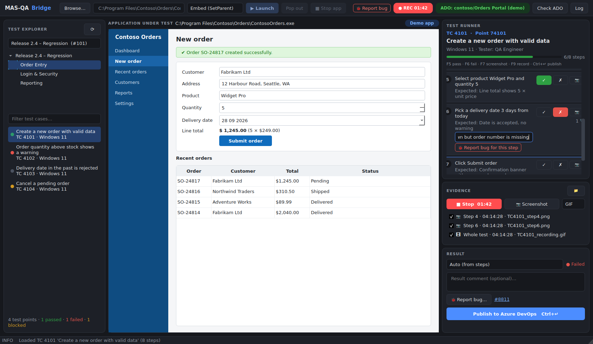
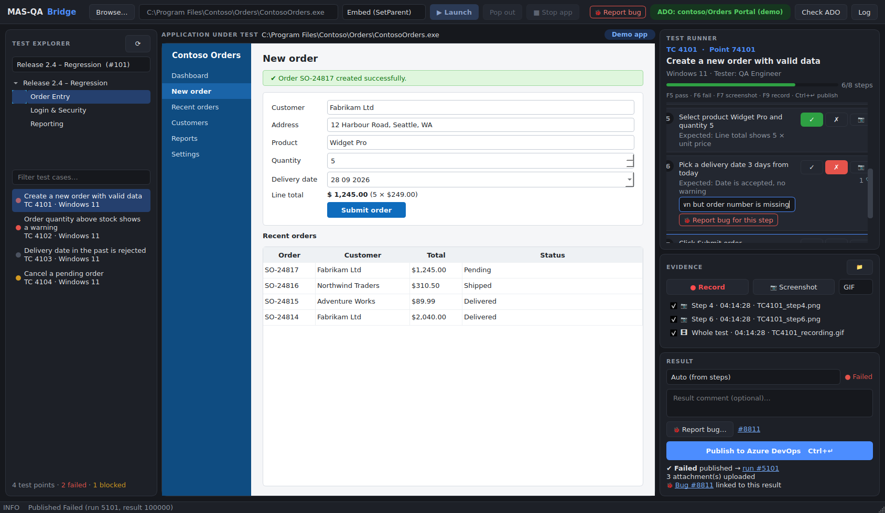
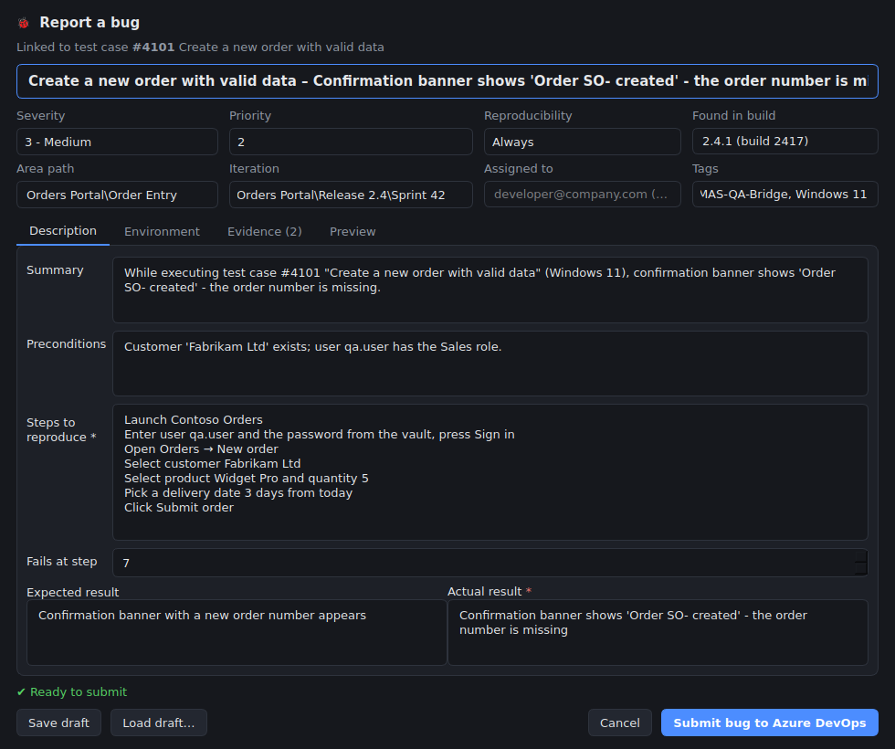
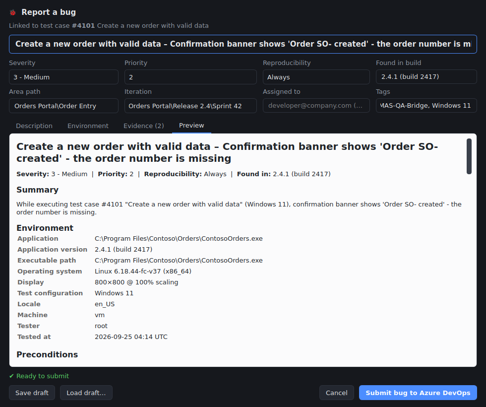

# MAS-QA-Bridge

A PyQt6 desktop workbench for **manual testing of Windows applications with Azure DevOps Test Plans**. You can:

- browse **Plan → Suite → Test point** from Azure DevOps,
- run the test case **step by step**, marking each step Pass/Fail next to the application under test, which is **embedded in the same window**,
- capture **screenshots per step** and **GIF/MP4 recordings** of only the application's area,
- **publish** the result with step outcomes and attached evidence,
- **report bugs** that give developers what they need to reproduce them: the application version, the environment, numbered steps with the failing one marked, expected vs actual, and screenshots shown inline. Each bug is linked to the test case and the test run.



*After publishing: the run and bug links appear and the point's status updates in the explorer.*



## Download the Windows app

Every push runs the **Windows build** workflow (`.github/workflows/windows-build.yml`) on a real Windows machine. It:

1. runs the unit tests,
2. runs a **smoke test**: it launches Notepad, embeds it (both modes), captures a screenshot and a GIF, and runs it as administrator and as a different user,
3. builds `MAS-QA-Bridge.exe` with PyInstaller and runs its `--self-test`,
4. uploads the **`MAS-QA-Bridge-windows`** artifact.

To get the app: open GitHub → **Actions** → *Windows build* → the latest run → **Artifacts** → `MAS-QA-Bridge-windows` (a zip). Unzip it anywhere and run:

- `Run Demo.bat` to try it without Azure DevOps,
- `MAS-QA-Bridge.exe` for real work. Edit the `config.yaml` next to it first.
- `MAS-QA-Bridge.exe --self-test` writes `self_test.log`, which is useful if something doesn't start.

The .exe is not code-signed, so Windows SmartScreen may warn you the first time. Click *More info → Run anyway*.

## Quick look (no Azure DevOps needed)

```powershell
pip install -r requirements.txt
python main_window.py --demo
```

Demo mode uses sample ADO data (a plan, suites, test cases with shared steps) and a sample "Contoso Orders" app. Everything except launching a real `.exe` works, including publishing and bug creation, which are simulated. Demo mode runs on Linux and macOS as well.

## Setup (Windows, Python 3.10+)

```powershell
python -m venv .venv
.venv\Scripts\activate
pip install -r requirements.txt
setx ADO_PAT "<personal-access-token>"      # then open a new terminal
python main_window.py
```

- The PAT needs these scopes: **Test Management: Read & write** and **Work Items: Read & write**. Work Items is used to read test steps and to create bugs.
- Click **Check ADO** in the header to confirm everything is reachable before you start.
- In `config.yaml`, set `ado.organization`, `ado.project` and, optionally, `ado.test_plan_id` (the plan to preselect) and `app.default_executable`.

## Workflow

1. **Browse… → ▶ Launch.** The application's window is embedded in the centre panel. *Pop out* returns it to the desktop, and *Re-embed* brings it back.
2. In the **Test Explorer**, pick a plan and a suite, then click a test point. The test case's steps load into the **Test Runner**. Shared steps are expanded.
3. For each step, click **✓** or **✗** (or press F5/F6). When you fail a step, you can type the actual result. Take a screenshot for the current step with **📷** or F7, and start or stop a recording with **● Record** or F9.
4. When a step fails, click **🐞 Report bug for this step**. See [Reporting bugs](#reporting-bugs).
5. Check the **Result** panel. The outcome is worked out from the steps: any failed step makes it Failed, and all passed makes it Passed. You can override it with Blocked or N/A. Then click **Publish** (Ctrl+Enter). Bugs you raised are linked to the result.

Publishing does the following:

```
POST  _apis/test/runs                                    run for the test point
GET   _apis/test/Runs/{run}/results                      result id
POST  _apis/test/Runs/{run}/Results/{id}/attachments     evidence (?iterationId&actionPath for step screenshots)
PATCH _apis/test/Runs/{run}/results                      outcome + iterationDetails.actionResults (per-step)
PATCH _apis/test/runs/{run}                              Completed
PATCH _apis/test/Runs/{run}/results                      associatedBugs (bugs raised during the test)
```

If a step fails before the run is completed, the run is set to **Aborted**, so no runs are left "In progress".

## Reporting bugs

In Azure DevOps a bug is a **work item** of type *Bug*. It is not part of the test case. It is **linked** to it:

```
Test Plan ─ Suite ─ Test point ─(run)─ Test result ──associated──┐
                        │                                        │
                    Test case ◄──── "Tested By" link ──────── Bug work item
                                                               (Repro Steps, Severity, Found In,
                                                                Area/Iteration, attachments)
```

MAS-QA-Bridge builds these links the way the ADO web Test Runner does. Open the form with:

- **🐞 Report bug for this step** on a failed step (pre-filled from that step),
- **🐞 Report bug…** in the Result panel, or **Ctrl+B**,
- **🐞 Report bug** in the header. With no test selected this creates an *exploratory* bug that is not linked to a test case.

Publishing a Failed result with no bug raised asks whether to report one first.



The form is pre-filled. You review it and add context:

| Section | Filled from | Why developers need it |
|---|---|---|
| Title | test case + the "actual result" of the failing step | Found in searches and on boards: *Screen – symptom* |
| Severity / Priority / Reproducibility | defaults in `config.yaml` | Triage order; "Intermittent" changes how devs investigate |
| Found in build | the .exe's version resource (`bug.app_version` overrides it) | So they debug the right build |
| Area / Iteration / Assigned to / Tags | ADO lists (area and iteration paths loaded from your project) | Routes the bug to the right team |
| Summary, Preconditions | generated summary; preconditions typed by you | Context and the starting state |
| Steps to reproduce | the test case steps up to the failing one, which is highlighted | Exact reproduction |
| Expected vs Actual | the step's expected result vs your comment | The actual defect |
| Environment | OS build, display resolution and DPI, configuration, locale, tester, time | Rules out environment-specific causes |
| Evidence | this test's screenshots and recordings (the failing step's first) | Screenshots appear inline, videos are attached |

The **Preview** tab shows exactly what the developer will see:



When you submit, the app:

1. uploads each piece of evidence (`POST _apis/wit/attachments`),
2. creates the bug (`POST _apis/wit/workitems/$Bug`) with Repro Steps, System Info, Severity, Priority, Found In, Area and Iteration, Tags and Assigned To,
3. adds relations: **Tested By** to the test case, a **Hyperlink** to the test run, and **AttachedFile** for each piece of evidence,
4. associates the bug with the test result, now if the result is already published or at publish time otherwise.

It only sends fields that exist in your project's process (Agile, Scrum and CMMI differ), and tells you which ones it skipped. For projects on the **Basic** process, set `bug.work_item_type: Issue`. If your process has custom required fields, supply them in `bug.extra_fields`.

**If submission fails** (a rule error, an expired PAT, a network error), the form stays open with the reason and the report is saved to `temp_evidence/bug_drafts/` as JSON and an HTML preview. Nothing is lost, and you can use **Load draft…** to retry.

## First run against a real Azure DevOps project

1. Try `python main_window.py --demo` first. In demo mode, a bug whose title contains `[simulate error]` shows the failure path.
2. Use a **sandbox project or test plan** for the first bugs, or tag them `[TEST]`.
3. Create a PAT with **Test Management: Read & write** and **Work Items: Read & write**, then set `ADO_PAT`.
4. Fill in the `ado:` and `bug:` sections of `config.yaml`.
5. Click **Check ADO**. It runs read-only checks: PAT, test plans, the Bug type and its required fields, and area/iteration paths. All rows should be ✅ before you file anything.
6. File one exploratory bug with the header button, then open it in ADO and check the fields, inline images and attachments.
7. Then run a real test case: fail a step, report the bug, and publish.

## Files

| File | Role |
|---|---|
| `app.py` | Entry point of the packaged .exe: writes any startup failure to `mas_qa_bridge_crash.log`. |
| `main_window.py` | Entry point. Builds the window and connects all the pieces. Slow work runs on background threads. |
| `widgets.py` | UI parts: Test Explorer, Step Runner (step cards), Evidence panel, Result panel, host frame. |
| `theme.py` | Dark theme stylesheet and colours for each outcome. |
| `window_manager.py` | Launches the app, finds its window (`EnumWindows` + `psutil` process tree) and embeds it using either **reparent** (`SetParent`) or **dock** mode. |
| `evidence_capture.py` | `mss` capture of the host area: PNG screenshots, GIF (`imageio`) or MP4 (`cv2`). |
| `ado_test_api.py` | Azure DevOps REST client (7.1): browsing test plans, step parsing, runs/results/attachments, bugs. |
| `qa_session.py` | Data model of one test execution: steps, their outcomes, evidence, timing and bugs raised. |
| `bug_report.py` | Structure of a bug report, its validation, the Repro Steps HTML, and local drafts. |
| `bug_dialog.py` | The "Report a bug" form: pre-filled, validated, with a live preview. |
| `run_as.py` | Launching as administrator (UAC) or as another user; elevation checks; Credential Manager. |
| `self_test.py` | `--self-test`: checks an installed build without opening a window. |
| `packaging/`, `.github/workflows/` | PyInstaller spec and the Windows build, smoke test and packaging pipeline. |
| `system_info.py` | Environment details: the .exe version, OS build, display/DPI, locale, tester. |
| `demo_data.py` | `--demo`: sample ADO data plus the sample app. |
| `tests/` | `pytest` tests that run offline against the demo data. |

## Run as: me / administrator / different user

A program started normally runs as the **same Windows account, with the same elevation**, as the program that started it. So if you start MAS-QA-Bridge as administrator, or with *Run as different user*, then **"Run as: me"** launches the application under test as that same account.

To launch it differently from how MAS-QA-Bridge is running, use the header selector:

| Choice | How | Notes |
|---|---|---|
| **Run as: me** | normal launch | same account and elevation as MAS-QA-Bridge |
| **Run as: administrator** | UAC prompt (`runas`) | On a standard account, UAC asks for an admin's credentials, and the app runs as that admin. |
| **Run as: different user…** | `CreateProcessWithLogonW` (same as Explorer's *Run as different user*) | Asks for an account and password. The password can be remembered in **Windows Credential Manager**, and is never written to config. The app runs with that user's profile, not elevated. |

**Embedding elevated apps:** Windows (UIPI) does not let a non-elevated program take over an elevated window. If you choose *administrator* while MAS-QA-Bridge is not elevated, the app offers to **restart MAS-QA-Bridge as administrator** (recommended; the app is then embedded as usual), or to run the app in a **separate window** (evidence recording still captures the area). Apps started as a *different user* (not elevated) can be embedded normally.

The account the app ran as is added to every bug's **Environment** section ("Application ran as").

## Embedding modes (header drop-down)

| Mode | How | Best for |
|---|---|---|
| **Embed (SetParent)** | The window becomes a real child of the dashboard. | Classic Win32, WinForms, Delphi and VB6 apps. |
| **Dock (overlay)** | A borderless window, *owned* by the dashboard, positioned exactly over the centre panel. | Apps that misbehave when re-parented: Chromium/Electron, some WPF, apps that lose their menu bar. |

Microsoft doesn't recommend cross-process `SetParent`: the two apps' input queues get linked, so if one freezes the other can too. Dock mode avoids this, so try it if an app behaves oddly when embedded.

## Known limitations

- A dashboard that isn't running as administrator cannot embed an elevated app (UIPI). Use *Restart as administrator*.
- UWP/Store apps (for example the Windows 11 Calculator) cannot be embedded.
- Recording captures the screen, so anything covering the application area is recorded too.
- Step-level attachments use the `iterationId`/`actionPath` query parameters. If a server rejects them, the file is attached to the result instead and a warning is logged.
